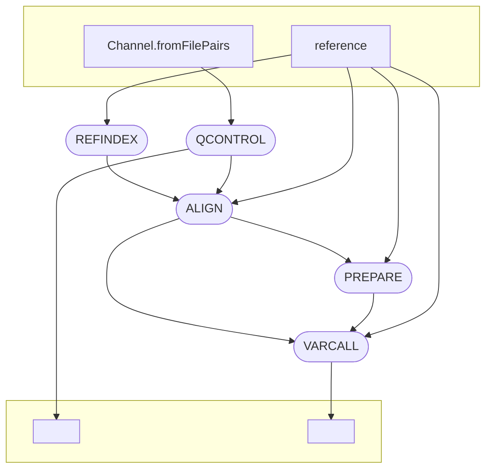

# Your Pipeline Name

This repository contains a Nextflow pipeline for analyzing Next-Generation Sequencing (NGS) data using octopus (https://github.com/luntergroup/octopus).



## Description

The pipeline is implemented in Nextflow and includes several stages for NGS data analysis:

1. **REFINDEX:** Index creation using BWA (Burrows-Wheeler Aligner).
2. **QCONTROL:** Data preprocessing using Fastp.
3. **ALIGN:** Sequence alignment using BWA mem.
4. **PREPARE:** File processing and preparation using Samtools.
5. **VARCALL:** Variant calling using Octopus.

## Usage

### Quick Start

To quickly run the pipeline, use the following command:

```bash
nextflow run glebus-sasha/octopus
```

### Requirements

- Nextflow (https://www.nextflow.io/)
- Singularity (https://sylabs.io/singularity/)

### Running the Pipeline

1. Install all the necessary dependencies such as Nextflow, Singularity.
3. Clone this repository: `git clone https://github.com/glebus-sasha/octopus.git`
4. Navigate to the pipeline directory: `cd octopus`
5. Edit the `nextflow.config` file to set the required parameters, if necessary.
6. Run the pipeline, setting the required parameters, for example:

```bash
nextflow run main.nf
```
