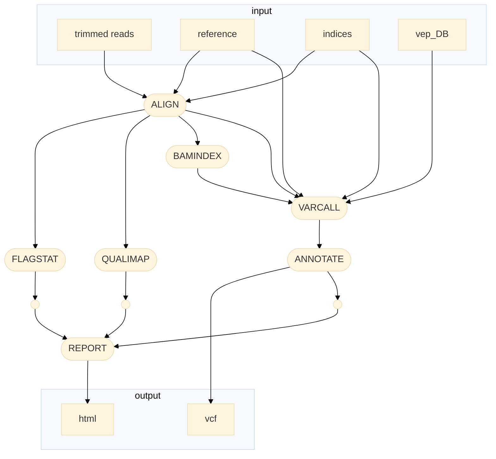

# octopus_nf

This repository contains a Nextflow variant calling pipeline for analyzing Next-Generation Sequencing (NGS) data using octopus (https://github.com/luntergroup/octopus).



## Description

The pipeline is implemented in Nextflow and includes several stages for NGS data analysis:

1. **ALIGN:** Sequence alignment using BWA mem.
2. **FLAGSTAT:** Alignment quality control using Samtools flagstat.
3. **QUALIMAP:** Alignment quality control using Qualimap.
4. **BAMINDEX:** Bai index creation using Samtools index.
5. **PREPARE:** File processing and preparation using Samtools.
9. **VARCALL:** Variant calling using deepvariant.
7. **ANNOTATE:** Annotation using VEP (Variant Effect Predictor).
8. **REPORT:** Compiling report using MultiQC.

## Usage

### Quick Start

To quickly run the pipeline, use the following command:

```bash
nextflow run glebus-sasha/octopus_nf \
-profile <docker/singularity> \
--reference <path-to-reference> \
--reads <path-to-reads-folder> \
--outdir results
```

### Requirements

- Nextflow (https://www.nextflow.io/docs/latest/install.html)
- Docker (https://docs.docker.com/engine/install/) or
- Singularity (https://github.com/sylabs/singularity/blob/main/INSTALL.md)

### Running the Pipeline

1. Install all the necessary dependencies such as Nextflow, Singularity.
3. Clone this repository: `git clone https://github.com/glebus-sasha/octopus.git`
4. Navigate to the pipeline directory: `cd octopus_nf`
5. Edit the `nextflow.config` file to set the required parameters, if necessary.
6. Run the pipeline, setting the required parameters, for example:

```bash
nextflow run main.nf
```

## License

This project is licensed under the [MIT License](LICENSE).
